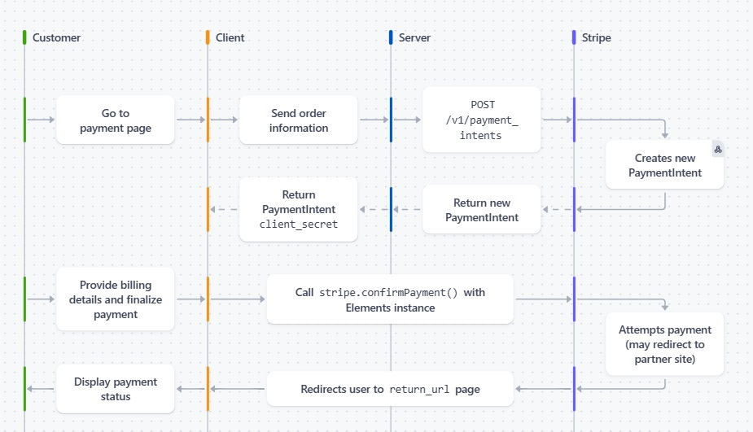

# Take home project - by Stan Wang

## How to build, configure and run your application

1. Install Node.js and npm:
    - Download and install Node.js from (https://nodejs.org/). npm is included with Node.js.

2. Create a Stripe account and retrieve test API keys:
    - Go to (https://dashboard.stripe.com/register) and create a free test account.
    - After logging in, navigate to the Developers section to find your test API keys.

3. Clone the repository and install dependencies:
    - Run the following commands in your terminal:
      ```bash
      git clone https://github.com/stanleyw1234/bookstore.git
      cd bookstore
      npm install
      ```

4. Rename `sample.env` to `.env` and populate it with your Stripe account's test API keys.

5. Run the application locally:
    ```bash
    npm start
    ```

6. Navigate to [http://localhost:3000](http://localhost:3000) to view the bookstore website!


## How does the solution work? Which Stripe APIs does it use? How is your application architected?

### Solution Highlights
This solution leverages the Stripe Payment Intent to securely accept global payments. It is seamlessly compatible with stepup authentications such as 3D Secure (3DS) mandated by SCA & PSD2 in the EU.

It also integrates Stripe Elements to create a custom UI to securely collect and process card details, which reduces fraud risk and ensures PCI compliance.

By avoiding redirection to third-party pages, it offers a smooth checkout experience and also enhances brand loyalty. 

Stripe solutions are easy to integrate, allowing merchants to quickly set up and accept global payments. This secure and seamless checkout experience will enhance customer trust, satisfaction, and conversion.

### Checkout Flow
1. Customer selects which book to purchase
2. Client passes the book id to the server
3. Server retrieves book price using book id, then create a paymentIntent with stripe using `amount` and `currency` parameters 
4. Stripe returns the created paymentIntent to server
5. Server retrieves `client_secret` from paymentIntent, then send it to client
6. Client populate Stripe Element form using paymentIntent `client_secret`
7. Customer enters card & billing details, then click submit 
8. Client submit element object to stripe to confirm payment
9. Stripe redirects customer to the specified return URL (`/success`).
10. Client retrieves paymentIntent from Stripe and displays the confirmation page with payment status, amount and  paymentIntent ID


reference: https://docs.stripe.com/payments/accept-a-payment?platform=web&ui=elements


### Stripe APIs Used
Most of the Stripe API calls are abstracted away by the `stripe.js` package, simplifying the integration process. Accoding to stripe document, there are several paymentIntent API calls used to create the paymentIntent, confirm the payment, and retrieve payment status & details. 

POST /v1/payment_intents                     : Create a paymentIntent

GET /v1/payment_intents/:id                  : Retrieve a paymentIntent

POST /v1/payment_intents/:id/confirm         : Confirm a payment

### Application Architecture
1. **Frontend**: The frontend is built using HTML, CSS (Bootstrap), and JavaScript. It provides the user interface for browsing books and initiating the checkout process.
2. **Backend**: The backend is built using Node.js and the Express framework. It handles API requests, interacts with Stripe's APIs, and manages the application's business logic.
3. **Environment Configuration**: The application uses environment variables to store sensitive information such as Stripe API keys. These are configured in the `.env` file.
4. **Routing**: The Express application defines routes to handle different endpoints, such as displaying books, creating checkout sessions, and confirming payments.


## How did you approach this problem? Which docs did you use to complete the project? What challenges did you encounter?

### I began by breaking down the requirements into several key actions:

-webapp passes book info to server (already implemented in template)

-server creates payment intent with stripe

-webapp creates payment form using element, gather and submit payment details to stripe for processing

-webapp retrieve and display payment status

Using stripe.js as the foundation, I mapped each required action to corresponding functions in stripe.js package


### Docs used:
I found useful step by step guide on how to implement stripe element from this tutorial:
https://docs.stripe.com/payments/accept-a-payment?platform=web&ui=elements

I also found useful tutorial videos from stripe developer channel on youtube, with examples helping me get started with node.js and express framework:
https://www.youtube.com/@StripeDev


### Challenges faced:
Time pressure: I was on business trip in China the whole week with packed schedules, and only had the weekends to finish this assignment. It was a bit rushed, and I only managed to implement the basic functionalities to have a "working demo".

Network issue in China:
Due to the "great firewall" in China, network connectivity to Github is not very stable, I used a VPN to access it. 

Troubleshooting some bugs:
I faced an issue with creating the Stripe element where the `client_secret` was not correctly passed as an argument. I double-checked the documentation and inserted several `console.log()` statements to track down the issue and eventually resolved it.

I initially tried to take a shortcut & pass `publishableKey` value from `checkout.hbs` to `success.hbs` but without success. In the end, I added an API endpoint on the server to retrieve the `publishableKey`.


## How you might extend this if you were building a more robust instance of the same application.

1. **Integrate Webhooks for Order Confirmation**:
    - Its good practice to implement a webhook on server to listen to stripe events, such as confirm payment status for fulfillments. Implement Stripe webhooks to listen for events such as `payment_intent.succeeded` and `payment_intent.payment_failed`.
    - Ensure webhook endpoints are secure by validating the Stripe signature to prevent unauthorized access.

2. **Allow User Profiles**:
    - Create user account on Stripe, allow saving cards for future seamless checkout
    - Allow users to view order and make refunds

3. **Other Payment Methods**:
    - Support other popular payment methods such as Apple Pay, Google Pay, and Buy Now Pay Later options
    - Integrate with regional payment methods like GrabPay in Singapore to cater to a wider audience
    - Complete merchant profile if necessary to accept other payment methods

4. **Scalability**:
    - Adopt a microservices architecture, decouple functionalities and allow flexibilityto scale each functionality independently
    - Use message queues like Kafka or Redis to manage order peaks (Black Friday and Cyber Monday etc), decouple data flow from actual processing.
    - Implement auto-scaling on cloud platforms (e.g., AWS, Azure) to dynamically adjust resources based on demand.
    - Implement load balancers to distribute incoming traffic across multiple servers, ensuring high availability and reliability.

5. **Security Enhancements**:
    - Use HTTPS to secure data transmission between the client and server.
    - Implement logging and monitoring to detect and respond to security incidents promptly.

6. **Fault Tolerance**:
    - Add comprehensive error handling to manage exceptions gracefully, providing meaningful error messages to users and logging errors for further analysis.
    - Implement retry mechanisms (exponential backoff) to handle transient network issues.
    - Set up failover strategies to ensure the application remains available even if some components fail.
    
7. **Other Stripe Functionalities**:
    - Include other functionalities to handle tax, invoicing, subscription/recurring payments etc.
    - Implement Stripe Radar to reduce risk of fraudulent chargebacks/disputes.


